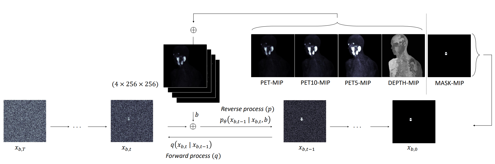

## MIP-DDPM

This repo contains the official Pytorch implementation of the paper **How To Segment in 3D Using 2D Models: Automated 3D Segmentation of Prostate Cancer Metastatic Lesions on PET Volumes Using Multi-Angle Maximum Intensity Projections and Diffusion Models**. The paper can be found [here](https://arxiv.org/pdf/2407.18555).



## Table of Contents
1. [Data](#data)
2. [Installation](#Installation)
3. [Data Preparation](#Data-Preparation)
    - [Preprocessing](#Preprocessing)
    - [Cropping](#Cropping)
    - [Train / Test Split](#Splitting)
4. [Network Training](#Training)
5. [Inferencing](#Inferencing)
6. [3D Reconstruction of segmentations](#3D-Reconstruction-of-segmentation-masks)
7. [Citation](#Citation)
7. [Acknowledgment](#Acknowledgment)


## Data
The dataset used in this work is a private PSMA-PET / CT dataset, from a post-hoc sub-group analysis of a prospective clinical trial. 
Inclusion criteria were: 
- histologically proven prostate cancer with biochemical recurrence after initial curative therapy with radical prostatectomy, with a PSA > 0.4 ng/mL and an additional measurement showing increase.
- histologically proven prostate cancer with biochemical recurrence after initial curative therapy with RT, with a PSA level > 2 ng/mL above the nadir after therapy.

Overall, it comprises 510 whole-body [18F]DCFPyL PSMA-PET/CT images from the same number of patients.

However, you can try this repo on your own dataset provided that you have a set of 3D PET images stored as Nifti files along with the 3D manual segmentation masks.


## Installation
This repo is tested on Ubuntu 16.04 and 18.04 lts using python 3.8, pytorch 1.9 and Cuda 11.1 .However it could be also installed on wsl on windows as well. 
Best practice for running this code is to use Conda environments.

First, clone this repository:

```
git clone https://github.com/Amirhosein2c/MIP-DDPM.git
```

Then change directory to the MIP-DDPM folder, and make a conda environment using the environment file:

```shell
cd ./MIP-DDPM
conda env create -f diff-environment.yml
```

Then go ahead and activate the environment:

```
conda activate diff
```


## Data-Preparation
Assuming your data is stored in a folder named `NIFTI_DATA_VOL` as follows:
```
NIFTI_DATA_VOL/
├── CT/
│   ├── PSMA-01-001__CT.nii.gz
│   ├── PSMA-01-003__CT.nii.gz
│   ├── PSMA-01-006__CT.nii.gz
│   ├── PSMA-01-008__CT.nii.gz
│   └── ...
├── MASK/
│   ├── PSMA-01-001__MASK.nii.gz
│   ├── PSMA-01-003__MASK.nii.gz
│   ├── PSMA-01-006__MASK.nii.gz
│   ├── PSMA-01-008__MASK.nii.gz
│   └── ...
└── PET/
    ├── PSMA-01-001__PET.nii.gz
    ├── PSMA-01-003__PET.nii.gz
    ├── PSMA-01-006__PET.nii.gz
    ├── PSMA-01-008__PET.nii.gz
    └── ...
```
You need to define two directories for storing the data after preprocessing for training MIP-DDPM.
To this end, you need to change the `config.yaml` file in `Data-Preparation` folder as follows:

```YAML
# config.yaml
nifti_vols_dir: "SOME/DIRECTORY/NIFTI_DATA_VOL"
temp_data_dir: "SOME/OTHER/DIRECTORY/TEMP"
data_dir: "SOME/OTHER/DIRECTORY/DATA"
```

# Preprocessing
`nifti_vols_dir` shows where your 3D nifti data is stored. `temp_data_dir` will store the MA-MIP projections before cropping, and `data_dir` is where the final processed data will be stored.
Now go ahead and run the `Data_Preparation.py` in `Data_Preparation` folder.
```shell
python ./Data_Preparation/Data_Preparation.py
```

# Cropping
Then we need to crop the MA-MIP projections and split them to top and bottom parts. In order to do that, run the following command:
```shell
python ./Data_Preparation/Crop_Images.py
```

You can check the whole preprocessing step by running the notebook in `Data_Preparation` folder, running the jupyter notebook named `Cropping_QC.ipynb`
```shell
./Data_Preparation/Cropping_QC.ipynb
```

# Splitting
Then, run the `Data_split.py` to split the processed data in training / testing partitions. Here we keep 85% of the data for train and validation, and the rest of 15% for testing.
```shell
python ./Data_Preparation/Data_split.py
```

Then run the `List_train_test_cases.ipynb` to make two text files containing the training and testing samples names. We need them for training and inferencing the model later on.
```shell
./Data_Preparation/List_train_test_cases.ipynb
```

## Training
All the codes for training and inferencing of the MIP-DDPM model can be found in `./Diffusion-based-Segmentation/scripts`.
Before training the model, you can check your `dataloader` to make sure it works properly.
To do so, run the jupyter notebook named `check_loaders.ipynb`.
```shell
./Data_Preparation/List_train_test_cases.ipynb
```
In order to modify the `dataloader` based on your own dataset, modify the code in `./Diffusion-based-Segmentation/guided_diffusion/bratsloader.py`

You can monitor the training / inferencing process using [Visdom](https://github.com/fossasia/visdom).
To do that, first you need to set the port first as follows:
```shell
visdom -port 8850
```

To train the model on your dataset, first you need to set some global flags as follows:

```shell

MODEL_FLAGS="--image_size 256 --num_channels 128 --class_cond False --num_res_blocks 2 --num_heads 1 --learn_sigma False --use_scale_shift_norm False --attention_resolutions 16"
DIFFUSION_FLAGS="--diffusion_steps 1000 --noise_schedule linear --rescale_learned_sigmas False --rescale_timesteps False"
TRAIN_FLAGS="--lr 1e-4 --batch_size 8"
```

Then run the training script using the following:
```shell
python scripts/segmentation_train.py --data_dir /datassd/PSMA_SEGMENTATION/DATA/training $TRAIN_FLAGS $MODEL_FLAGS $DIFFUSION_FLAGS
```

For more details about training the DDPM model for segmentation task, please refer to the github repository of [Diffusion Models for Implicit Image Segmentation Ensembles](https://github.com/JuliaWolleb/Diffusion-based-Segmentation/blob/main/README.md). by Dr. Julia Wolleb.

## Inferencing
In order to perform segmentation using the trained model, depending the number of GPUs you have access to, there are different scripts that can be used to do so.

#### Single GPU
For single GPU inferencing you can run the script `scripts/segmentation_sample.py`

```shell
python scripts/segmentation_sample.py  --model_path ./results/savedmodel100000.pt --num_ensemble=10 $MODEL_FLAGS $DIFFUSION_FLAGS
```

Here, `--model_path` shows the trained weights of the network, stored in `results` folder.

#### Multiple GPUs

In case of having more than one GPU, you can divide the inferencing step to run each part on one GPU. You can refer to the scripts `Inference_and_save_gpu-0.ipynb` and run them based on the number of GPUs you have access to.

Please also note that in our method we do ensemble of 10 times inferences and use the mean image of the 10 segmentation masks as the final segmentation projection per each MA-MIP. This number is one of the hyperparameters that can be set in the code / environment variables.

## 3D Reconstruction of segmentation masks
Result of the last step is predicted segmentation masks of the ROIs but in MIP projection space. So in order to transform it back to the original 3D space, we used OSEM algorithm.
To do so, first run the `Seg_Recon.ipynb` in `./Reconstruction` directory. This will store the ground truth MA-MIP segmentation masks and the predicted ones in order to perform reconstruction and evaluation.

```shell
./Reconstruction/Seg_Recon.ipynb
```

Now in order to backproject the segmentation masks from MA-MIP space to the 3D space, use the jupyter notebook `RECON_SEG_DICE.ipynb` in the `./Reconstruction` directory.
Please note that, for reconstruction algorithm we used OSEM implementation provided by [PyTomography](https://github.com/PyTomography) toolbox.


## Citation

If you use this code repository, please cite our paper:
```
@inproceedings{toosi2024segment,
  title={How to Segment in 3D Using 2D Models: Automated 3D Segmentation of Prostate Cancer Metastatic Lesions on PET Volumes Using Multi-angle Maximum Intensity Projections and Diffusion Models},
  author={Toosi, Amirhosein and Harsini, Sara and B{\'e}nard, Fran{\c{c}}ois and Uribe, Carlos and Rahmim, Arman},
  booktitle={MICCAI Workshop on Deep Generative Models},
  pages={212--221},
  year={2024},
  organization={Springer}
}
```

## Acknowledgment

Authors would like to thank Dr. Julia Wolleb for generously sharing their code for the [Diffusion Models for Implicit Image Segmentation Ensembles](https://github.com/JuliaWolleb/Diffusion-based-Segmentation/blob/main/README.md). The segmentation part of our method is heavily borrowed from their work.

We would like to also thank [PyTomography](https://github.com/PyTomography) authors for their awesome 3D reconstruction algorithms implementation toolbox. 
